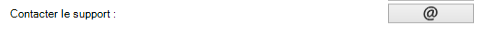

# Support et questions fréquentes

## Comment signaler un comportement anormal ?

Si vous obtenez un message d'erreur ou bien vous constatez un comportement anormal :

* aller dans l'onglet `Paramètres` 
* cliquer sur  : 
* remplir et adapter le modèle de mail qui s'est ouvert dans votre client de messagerie électronique

Si aucun client de messagerie n'est configuré, il peut arriver que le modèle de mail ne s'affiche pas. Dans ces cas-là, envoyer un mail à [support+arcmap@isogeo.fr](mailto:support+arcmap@isogeo.fr).

___

## Questions fréquentes

### Pourquoi n'y a t'il aucune donnée dans mon plugin ?

Vérifier qu'au moins un partage alimente l'application : voir [comment partager à l'application depuis Isogeo](/usage/configuration.md#share).

### Pourquoi aucun résultat n'est ajoutable ?

Pour qu'une donnée soit ajoutable à la carte, il faut que des informations le permettant soient cataloguées dans la métadonnée. 

Pour en savoir plus, [consulter la section dédiée dans la documentation](/usage/display.md).

### Pourquoi mon service WMS ne s'affiche pas alors que sa légende est bien présente ?

Il peut y avoir plusieurs raisons :

- le service WMS n'est pas conforme aux exigences de QGIS ;
- des caractères spéciaux sont présents dans certains des intitulés (titre, étiquettes légende...) et l'encodage n'est pas conforme ;
- le style par défaut de la couche du WMS contient une anomalie ;

### L'ajout de donnée prend-il en compte les fichiers de symbologie (.qlr) ?

Oui, si le qlr se nomme de la même façon que le fichier de la donnée source et est situé dans le même dossier.

