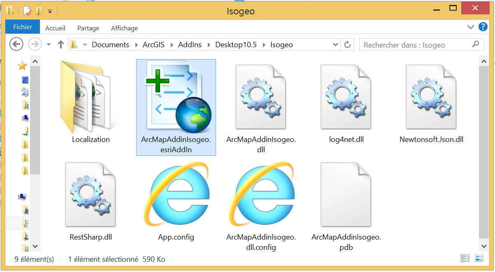
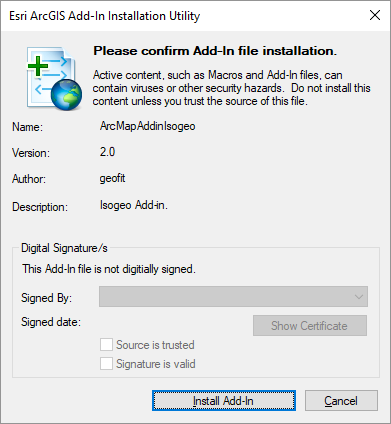
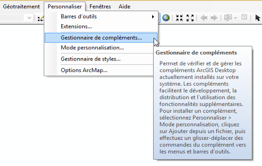
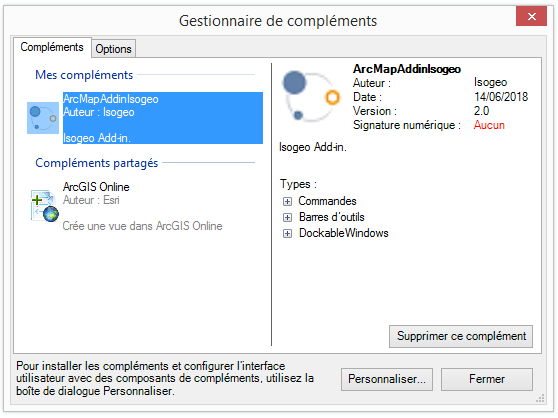
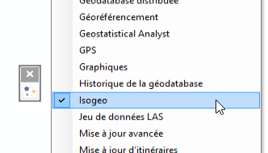
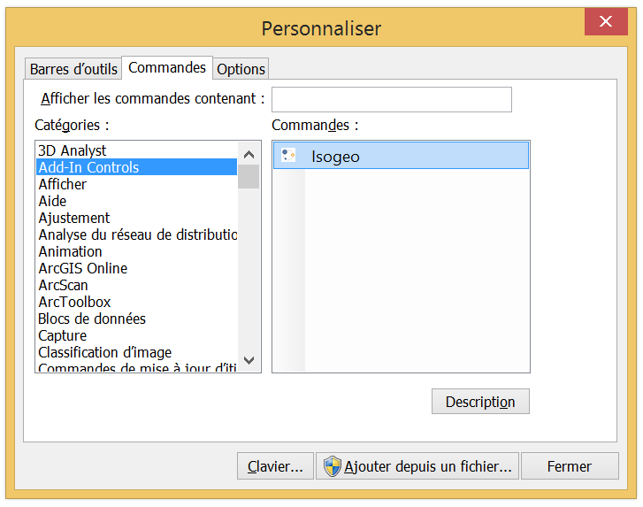

# Installation standard

Installation classique pour les utilisateurs non administrateurs de leur poste.

## Pas à pas {#install-steps}

La procédure se déroule en 2 grandes étapes : installer le plugin puis l'ajouter à l'interface.

### I. Installer le plugin

1. Dézipper la nouvelle version dans un dossier dédié. Pour être cohérent avec le fonctionnement d'ArcGIS, nous recommandons d'utiliser le dossier des _AddIns_ dans `Mes Documents` : `C:\Users\$USER\Documents\ArcGIS\AddIns\Desktop10.X\Isogeo` (noter le X à remplacer selon votre version)

2. Double-cliquer sur **ArcMapAddinIsogeo.esriAddIn** :
    
    
    
3. La fenêtre suivante s'ouvre :
    
    

5. Valider en cliquant sur **Install Add-In**.

Le plugin est désormais référencé dans les compléments d'ArcMap. Il s'agit maintenant de l'ajouter à l'interface de travail d'ArcMap.

---

### II.Ajouter le plugin à l'interface

1. Lancer ArcMap
2. Ouvrir le menu **Personnaliser / Gestionnaire de compléments**

    

3. Dans la section "Mes compléments", le plugin apparaît :

    

4. Cliquer sur **"Personnaliser..."** (ou faire menu _Personnaliser / Mode personnalisation_). Deux options d'ajout sont alors possibles, selon les habitudes de chacun :

    * Ajouter une barre d'outils dédiée au plugin Isogeo
    * Ajouter l'icône du plugin Isogeo à une barre d'outils existante

#### II.a Ajouter une barre d'outils dédiée

1. Dans l'onglet **Barre d'outils**, descendre dans la liste et cocher Isogeo
2. Glisser-déposer la barre d'outils apparue à sa convenance :

> Astuce : il est également possible de faire un clic-droit, dans une barre d'outils existante, de cocher Isogeo, puis de placer la barre de la même manière :
> 

#### II.b Ajouter l'icône à une barre d'outils existante

1. Aller dans l'onglet **Commandes**, attendre le chargement de la liste des catégories et sélectioner **Add-In Controls** :

    

2. Glisser-déposer l'icône Isogeo dans la barre d'outils :

