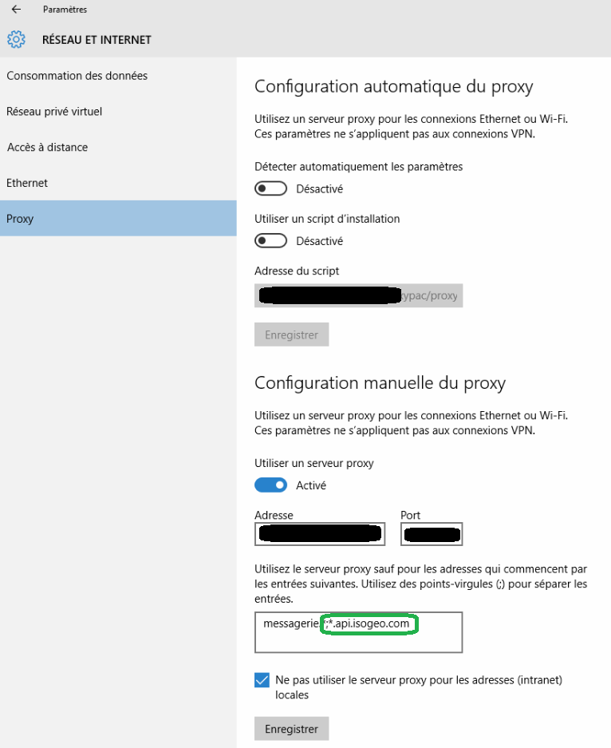

# Prérequis

## Environnement technique

* ArcMap - ArcGIS Desktop 10.x : versions supportées et maintenues par Esri
* une connexion autorisée et configurée \(proxy, pare-feu...\) vers [https://v1.api.isogeo.com/\*](https://v1.api.isogeo.com/) et [https://id.api.isogeo.com/\*](https://v1.api.isogeo.com/)

Si la connexion est derrière un proxy, il est parfois possible de le configurer directement depuis les paramètres Windows. Exemple sous Windows 10 :

---

## Accès Isogeo

### Pour consulter ses propres données

* au moins un groupe de travail Isogeo ;
* au moins un catalogue contenant au moins une métadonnée, partagé au plugin ;
* des clés d'authentification auprès de l'API Isogeo ;

### Pour consulter des données publiques

// A PRECISER //

