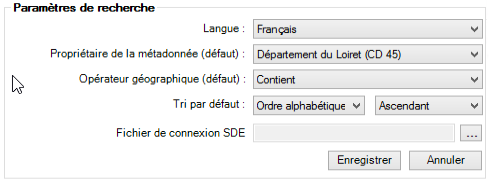

# Paramétrer la recherche

Dans l'onglet `Paramètres`, l’utilisateur peut spécifier quelques réglages sur la recherche :

* la langue de recherche (également celle de l'interface du plugin)
* filtrer par défaut sur un groupe de travail Isogeo qui a créé la métadonnée (_Propriétaire de la métadonnée_)
* l'opérateur géométrique appliqué aux recherches géographiques ([voir section dédiée](/usage/search.md#geometric))
* les paramètres de tri
* le fichier de connexion SDE pour les données en base Esri

