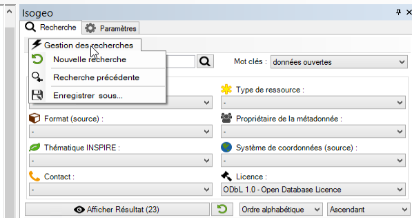
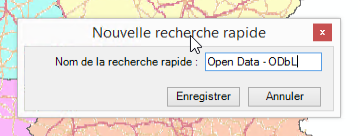
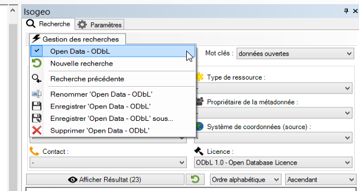

# Recherches rapides

Afin de gagner du temps en évitant de reproduire des recherches, le plugin intègre un gestionnaire de recherches rapides. Par défaut, on y trouve la recherche précédente mais c'est entièrement personnalisable par l'utilisateur.

## Enregistrer une recherche rapide {#quicksearch_new}

Toute recherche, quel que soit le nombre de filtres utilisés, peut être enregistrée sous un profil nommé. Une fois la recherche enregistrée, elle peut être exécutée sans avoir à agir sur les différents filtres.

Pour enregistrer une recherche :

1. Après avoir tapé du texte dans la barre de recherche et/ou agi sur les différents filtres, cliquer sur le bouton `Gestion des recherches` pour afficher le menu dédié et sélectionner `Enregistrer sous...` :

    

2. Lui donner un nom dans la fenêtre qui apparait

    

La recherche est désormais enregistrée.

## Utiliser une recherche rapide {#quicksearch_use}

Choisir la recherche enregistrée dans la liste déroulante pour exécuter la recherche rapidement :

