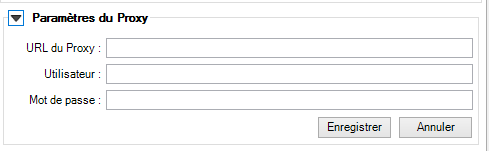
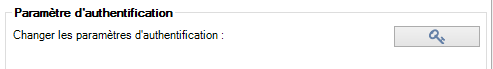

# Configuration et paramètres

## Connexion à travers un proxy {#proxy}

Si le connexion à l'API Isogeo ([voir les prérequis](/prerequisites.md)) passe par un proxy (serveur mandataire) ou un pare-feu réclamant une authentification, l'utilisateur doit spécifier les paramètres dans l'onglet `Paramètres` :

---

## Changer les clés d'authentification {#auth-change}

Si les clés d'authentification à l'API Isogeo ne sont plus valables, il est possible de les changer manuellement dans l'onglet `Paramètres` :

---

## Partager les catalogues de ses données au plugin {#share}

Créer un partage avec un ou plusieurs catalogues vers l'application _Plugin ArcMap_ dans l'administration des partages sur [APP](https://app.isogeo.com) ;

---

## Ancrer ou déplacer le plugin librement {#positionning}

A l'instar des autres volets de l'interface d'ArcGIS, il est possible de choisir où positionner la fenêtre du plugin et de la minimiser dynamiquement. Par exemple :

* sur la droite de l'interface (position par défaut)
* sur la gauche comme onglet alternatif à la "Table des matières)
