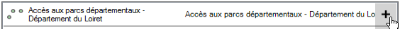
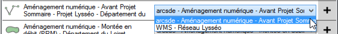
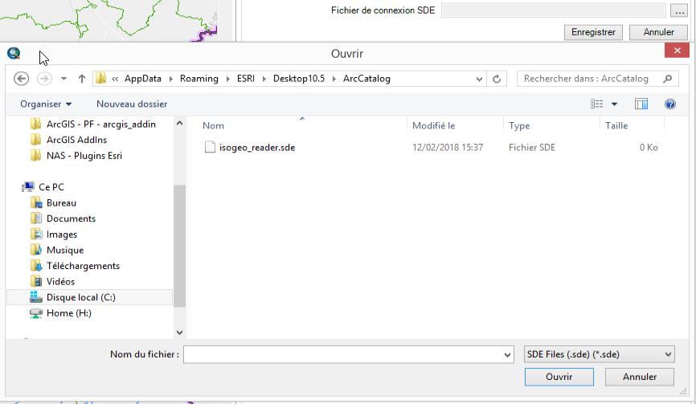

# Ajouter une donnée à la carte

Pour ajouter une donnée à la carte, la troisième colonne (dite "Ajouter") liste les options possibles.

Il y a plusieurs cas de figure :

- La donnée peut être ajoutée d'une seule manière. Auquel cas, la colonne "Ajouter" ne comprend qu'un bouton. Au clic sur le bouton `+`, la donnée sera ajoutée à la carte.

- La donnée peut être ajoutée de plusieurs manières différentes. Auquel cas, la colonne "Ajouter" comprend une liste déroulante permettant à l'utilisateur de choisir entre les différentes options avant de cliquer sur `+` :

___

## Critères

### Données fichier {#add-file}

Le chemin vers la donnée doit être rempli dans le champ `Emplacement de la donnée` sur https://app.isogeo.com. Ce chemin doit être accessible :

* par l'utilisateur ayant lancé ArcGIS (droits en lecture);
* depuis le poste sur lequel le plugin se trouve (en local ou via le réseau local).

#### Formats supportés

##### Vecteur

\\A DOCUMENTER //

##### Raster

\\A DOCUMENTER //

### Données SDE {#add-sde}

Une table SDE pourra être ajoutée par le plugin dans les conditions suivantes : 

- L'utilisateur a renseigné le fichier de connexion SDE à utiliser dans l'onglet `Paramètres`
- La fiche documentant la table a été créée à partir du scan FME Isogeo. En créant une fiche manuellement dans https://app.isogeo.com, il est impossible de renseigner le champ *name* nécessaire à l’ajout de la table.

### Services géographiques {#add-service}

Le plugin supporte les couches de services documentés automatiquement et associées aux métadonnées de données.  

Consulter [l'aide en ligne Isogeo au sujet du recensement automatisé des services et de l'association couche de service / donnée cataloguée](http://help.isogeo.com/fr/features/inventory/md_services/srv_intro.html).

#### Formats de services supportés

- Web Feature Service (WFS)
- Web Map Service (WMS)
- Web Map Tile Service (WMTS)
- Esri Feature Service (EFS)
- Esri Map Service (EMS)
