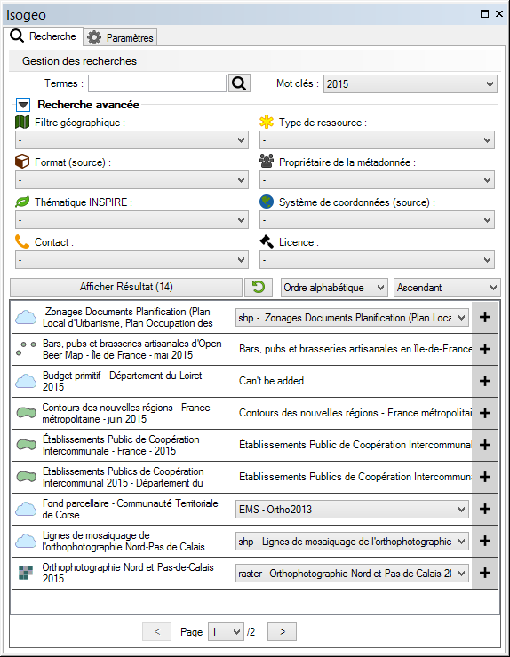
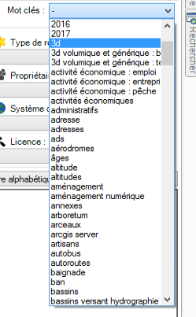
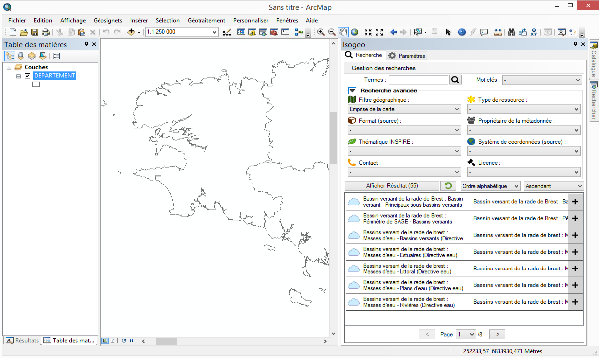
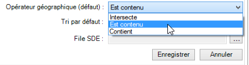
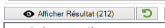
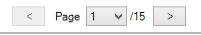

# Rechercher

Pour tenir compte du moteur de recherche Isogeo \(basé sur le principes des facettes contextuelles\) mais aussi des performances, la recherche se passe en deux temps :

1. l'utilisateur entre les paramètres de sa recherche qui ressert de plus en plus le nombre de résultats \(principe de l'entonnoir\) ;
2. l'utilisateur affiche et parcourt la liste des résultats

De là il peut alors [consulter la métadonnée](/usage/metadata.md) ou [ajouter la donnée à sa carte](/usage/display.md).

## Recherche sémantique {#search-terms}

La recherche textuelle s'effectue dans la barre de saisie de texte en haut à gauche de la fenêtre du plugin.

Les termes saisis sont recherchés au sein :

* du titre de la fiche de métadonnées
* du nom du fichier
* de son résumé
* de ses mots-clés
* de ses thèmes INSPIRE

Pour en savoir plus sur le fonctionnement du moteur de recherche Isogeo, [consulter l'aide en ligne](http://help.isogeo.com/fr/features/inventory/search.html).

## Filtres contextuels {#filters}

### Filtre par mot-clé {#keywords}

Pour filtrer sur un mot-clé, sélectionner dans la liste déroulante dédiée.

### Autres filtres

Tous les autres filtres sémantiques fonctionnent de la même manière \(sélection d'une modalité dans une liste déroulante\).

Tous les filtres sont inter-dépendants \(contextuels\). Ainsi l'application d'un filtre fait évoluer les modalités disponibles dans toutes les listes déroulantes et le nombre de résultats correspondant.

### Filtre géographique {#geometric}

Il est également possible de filtrer les résultats à partir de l'emprise de la carte.

Par défaut, le filtre géographique remonte toute les données qui **intersectent** l'emprise considérée. Pour changer ce comportement, aller dans l'onglet "Paramètres", choisir un opérateur différent, puis relancer la recherche.

---

## Afficher les résultats {#display}

Lors de la saisie de texte dans la barre de recherche et de l'action sur un filtre sémantique, le contenu des autres filtres se met à jour, et le nombre de résultats attendus s'affiche à côté de l'oeil.

Au clic sur ce bouton, les résultats de la recherche sont affichés dans le tableau, paginés de manière à n'afficher autant de résultats que la hauteur de la fenêtre le permet.

Pour chaque résultat, on trouve :

* le titre affecté à la fiche de métadonnée, au survol duquel s'affiche le résumé
* une icône représentant le type de données
* les modalités d'ajout disponibles pour cette donnée

Deux boutons sont consacrés à la navigation entre les différentes pages de résultats en bas du tableau :

### Trier les résultats {#order}

Une fois affichés, les résultats peuvent être triés.

Le tri par défaut est **le score de pertinence** \(voir [ici pour le détail du calcul du score](http://help.isogeo.com/fr/features/inventory/search.html#pertinence-)\). Il s'agit du tri recommandé lors de recherches textuelles.

Lorsqu'aucun texte n'est saisi dans la barre de recherche, le score de pertinence étant nul pour tous les résultats c'est alors le tri décroissant par date de création de la fiche de métadonnée qui est appliqué par défaut.

Les autres tris disponibles sont :

* Ordre alphabétique
* Date de création de la métadonnée
* Date de dernière modification de la métadonnée
* Date de création de la donnée
* Date de dernière modification de la donnée

---

## Réinitialiser la recherche {#search-reset}

A tout moment, il est possible de réinitialiser le formulaire de recherche :

* soit en cliquant sur l'icône à côté du bouton d'affichage des résultats
* soit en cliquant sur le menu `Gestion des recherches` puis sur `Nouvelle recherche`

